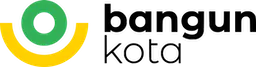

# bangunkota.com 

*[link development](https://fair-blue-pigeon-wig.cyclic.app/)


<p align="center">
  <a href="http://nestjs.com/" target="blank"></a>
  <a href="" target="blank"></a>
</p>

  
  <p align="center">Backend application for bangunkota.com using proggresive <a href="http://nodejs.org" target="_blank">Node.js</a> framework  </p>
   
## Description

this application will handle backend for bangunkota.com

## Installation

```bash
$ npm install
```

## Running the app

```bash
# development - watch mode
$ npm run start:dev

# development - debug & watch mode
$ npm run start:debug

# production mode
$ npm run start
```

## Test

```bash
# unit tests
$ npm run test

# e2e tests
$ npm run test:e2e

# test coverage
$ npm run test:cov
```

## Support

Nest is an MIT-licensed open source project. It can grow thanks to the sponsors and support by the amazing backers. If you'd like to join them, please [read more here](https://docs.nestjs.com/support).

## Stay in touch

- Lembar Team

## License

  Nest is [MIT licensed](https://github.com/nestjs/nest/blob/master/LICENSE).
